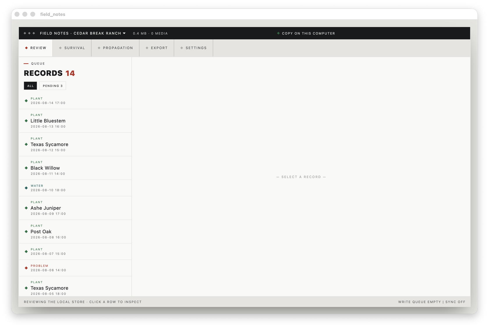
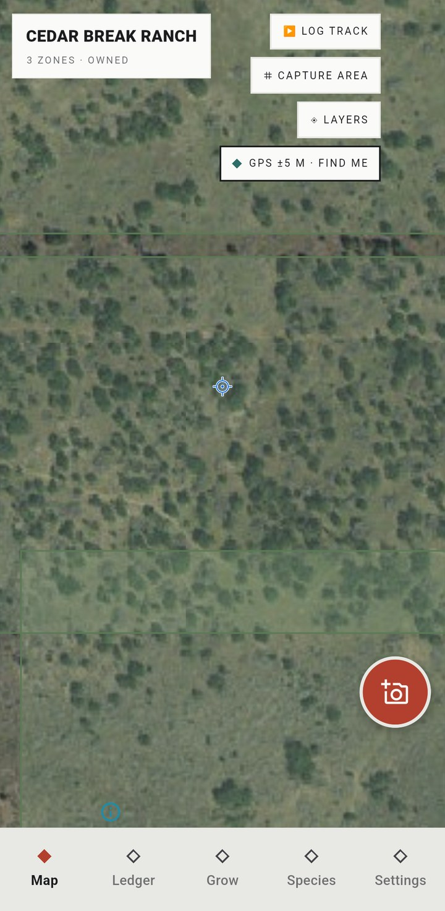
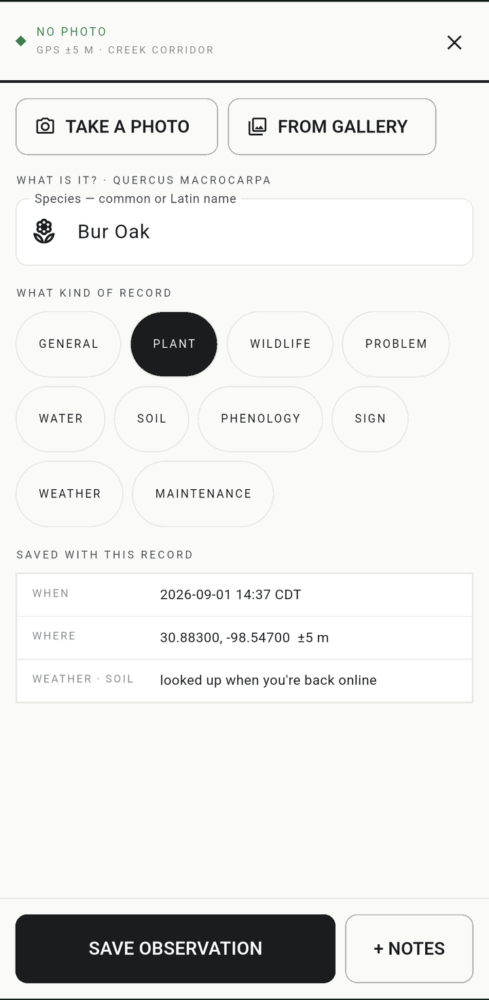
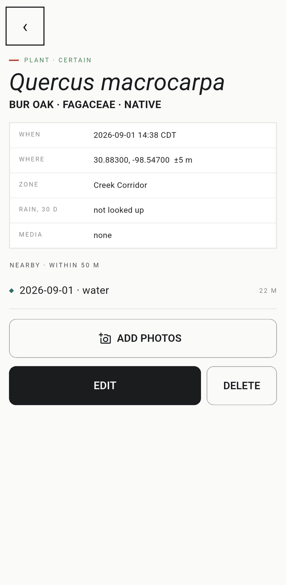
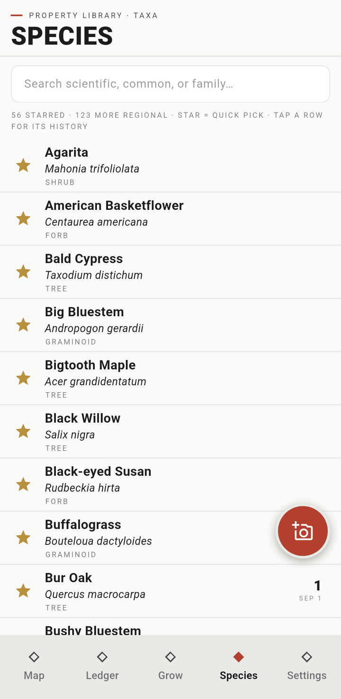
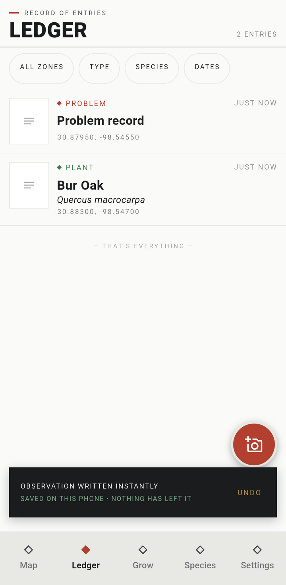
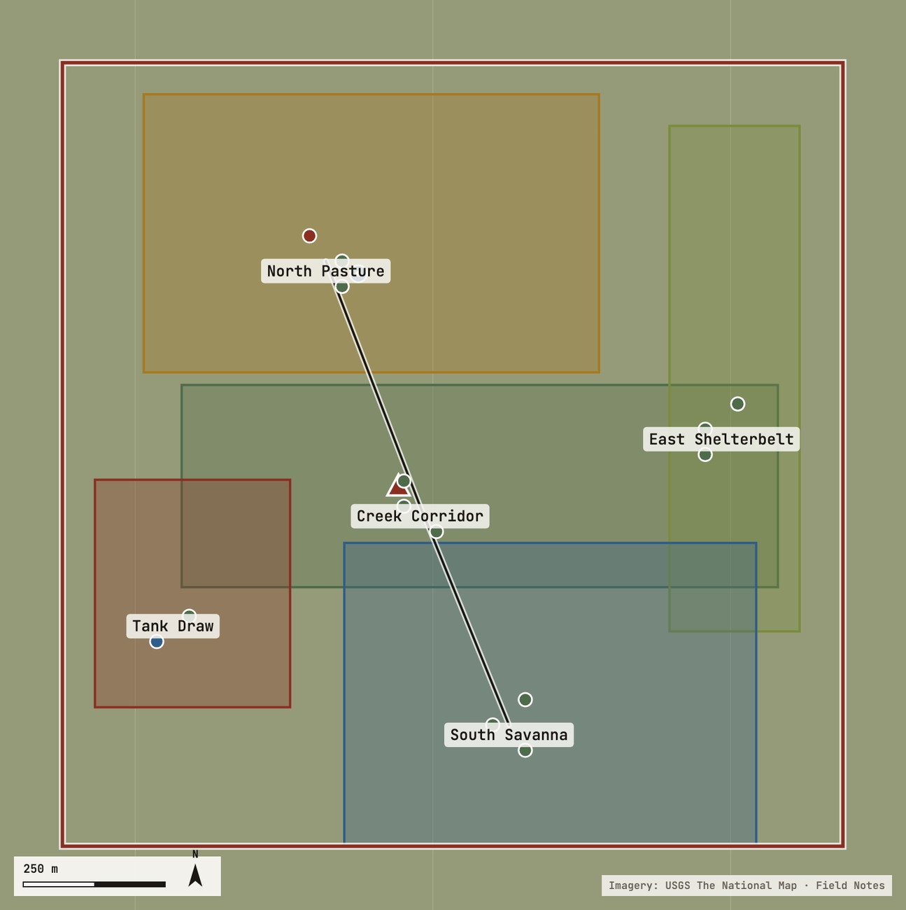
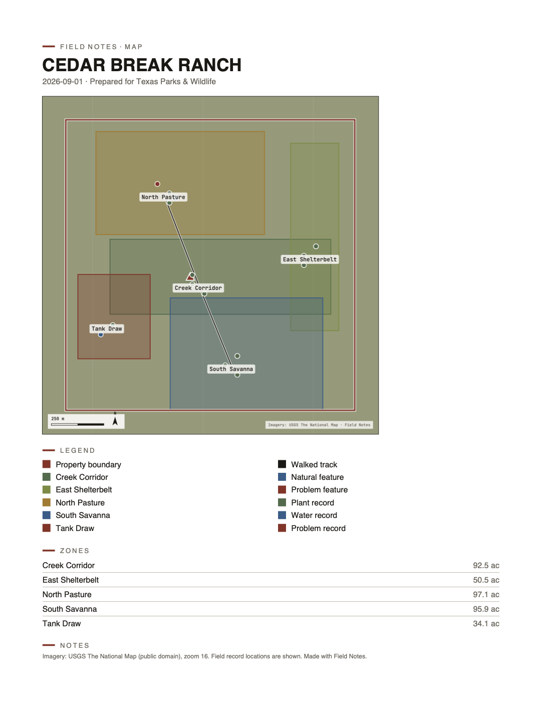
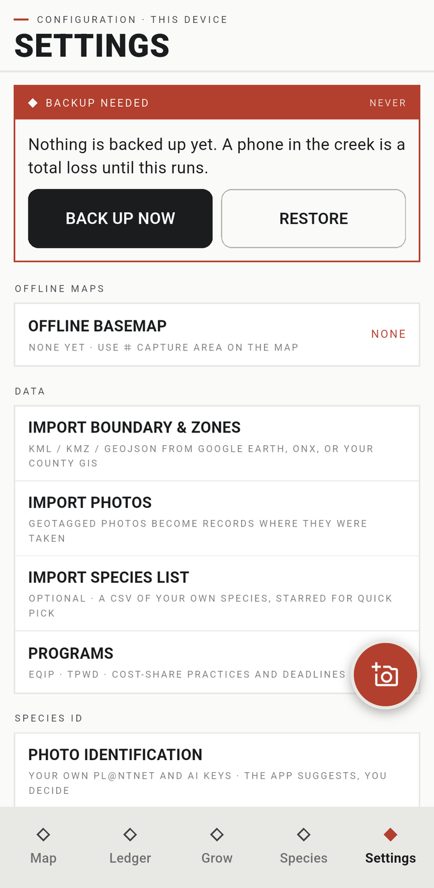

# Field Notes

A local-first field journal for people who own and actively manage land.

Walk the property, photograph what you find, write it down. Every record is a
point on a map with a time, a photo, an optional species and a note. Plantings
are followed from the cutting you took through propagation to whether the thing
is still alive four years later. Springs, guzzlers and headcuts carry condition
histories. Photo points walk you back to the same frame with the last visit
ghosted over the viewfinder so the comparison is honest.

It runs on a phone in the field and on a desktop at the desk. The phone is for
capture — point, shoot, identify, keep walking. The desk is for the part that
turns a pile of records into something you can hand to somebody: review what
came in, fix what's wrong, draw it as a map or a report.

Everything is stored locally first. It works with the radio off, and nothing
leaves the machine without an explicit action. A full export reconstructs the
whole dataset in formats other tools already read — SQLite, CSV, GeoJSON, KML,
JPEG with EXIF GPS, m4a.



## The phone

<p>





</p>

Shape says what kind of thing a mark is, colour says the domain, size and halo
say which layer it belongs to. A plant flagged for removal wears a red ring
around whatever colour it already had — the dot keeps telling you what the
plant is while the ring tells you it's coming out.

Identification runs two ways and neither one decides anything. Suggestions are
kept with their scores and their source; a name only lands on a record when a
person puts it there.

## The desk

Seven workspaces: Map, Ledger, Grow, Species, Review, Export, Settings.

`maplibre_gl` has no desktop platform, so the desk draws its own slippy map on
a `CustomPaint` — tiles, zones, boundary, tracks, features, records, in that
order, with clustering and hit-testing on top. Trackpad pinch included, because
a map you can't zoom with two fingers on a laptop is a map nobody uses.

Review is where contributed records get approved or thrown out. Export is a
publishing bench: pick layers, watch the page compose itself, save it as PDF,
PNG, Word or a self-contained interactive HTML map.

<p>


</p>

Field records are **off** by default on anything you export, and the control
says why in plain language next to the switch. Fine for a partner you trust;
not for the website.

## Monitoring

Seven starter methods — cover check, brush count, cover pole, bird listen, pin
walk, soil surface, spotlight drive — each with a fixed site, a cadence and a
form. A run is also an observation, so it rides the ledger, the map, export,
review and sync without any new plumbing behind it.

Indicators (percent cover, stems per acre, richness, deer per acre) are derived
on read. Nothing computed is ever stored, so a fixed bug fixes the history too.

## Importing a map

KML, KMZ, GeoJSON and GPX from a file, or an Earth / My Maps share link the app
fetches itself. Zones arrive with the colour you drew them in, their acreage
computed from the ring, and a guess at their type from the name.

Re-importing the same map updates the zones in place instead of stacking
duplicates beside them, so draw → export → import → look → redraw is a loop you
can actually run. Every import is registered, and removing one takes its zones
with it while leaving anything hand-drawn alone.

## Sync and backups

Two paths, by design. Google Drive carries the free seats — each person's own
Drive, `drive.file` scope, no server of ours in the middle. Commercial seats get
the relay in `relay/`: one Go binary, a SQLite control plane, blobs to S3 or a
directory.

Backups are encrypted with XChaCha20-Poly1305 under an Argon2id key and a BIP-39
recovery phrase. Restore asks the question backups exist to answer, and VERIFY
BACKUP answers it before you need it to.



## Layout

```
app/          the Flutter project (field_notes, io.nativeplanet)
relay/        the sync relay — Go, SQLite, S3 or a directory
docs/SPEC.md  the build spec; §4 (data model) is the contract
DECISIONS.md  the decision log, and the only place a spec deviation is recorded
```

Rules worth knowing before reading the code: UUIDv7 keys, ISO-8601 UTC plus a
`local_tz` column, GeoJSON stored as text beside denormalised lat/lng, soft
delete everywhere. `gps_accuracy_m = -1` means *not located* — the stored
coordinate is a stand-in and every consumer has to treat it as absent rather
than quietly drop a pin in the wrong place. Survival is always derived, never
stored. Schema is at v11; migrations live in `app/lib/db/database.dart`.

## Build

Flutter 3.47+, and **JDK 21** for Android — `maplibre_gl` needs source level 21
and JDK 17 fails with an error that doesn't say so.

```sh
cd app
flutter pub get
flutter test

# Android
flutter config --jdk-dir /opt/homebrew/opt/openjdk@21   # macOS
flutter build apk --release        # needs android/key.properties (gitignored)
adb install -r build/app/outputs/flutter-apk/app-release.apk

# macOS desktop
flutter build macos --release
open build/macos/Build/Products/Release/field_notes.app
```

After a schema change, `dart run build_runner build --delete-conflicting-outputs`.

Offline basemaps: frame an area on the map and tap **⌗ Capture area**, or import
a `.pmtiles` file under Settings → Offline maps. Tiles are served to the map
from a loopback `shelf` server. `docs/basemap/` is gitignored — planet extracts
don't belong in git.

Only USGS and NAIP imagery is ever written to disk. Esri's terms don't permit
storing their tiles, so the Esri layer is display-only and the offline path uses
the public-domain sources.

## Stack

Flutter and drift over SQLite · `maplibre_gl` on the phone, a hand-rolled
painter on the desk · PMTiles and MBTiles behind a loopback `shelf` server ·
`geolocator` behind a single-owner `LocationHub` · `camera`, `record` and
`speech_to_text` · `cryptography` for the backup crypto · `turf` for the
geometry · Go for the relay.
